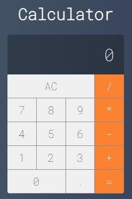

  <h2 align="center">Basic Calculator Developed with React</h2>

  
 

## How to Run
1. Clone repository;
2. Open folder in your explorer;
3. Run in terminal the command: npm install;
4. Run in terminal the command: npm start;
5. Access http://localhost:3000 in the browser;
6. Use calculator.
